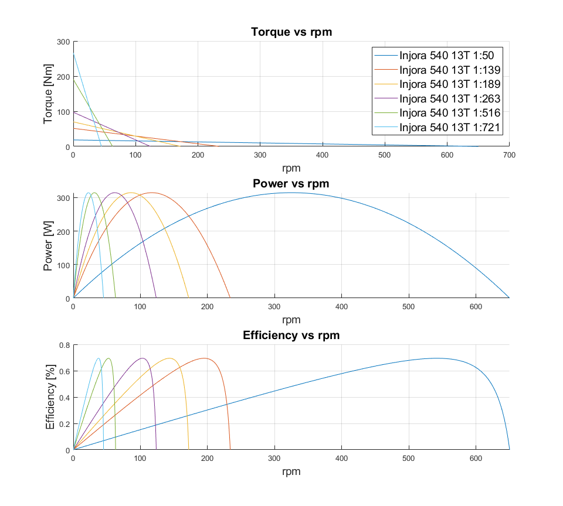

# Full-metal RC-TANK in 1:11 Scale
Project of full-metal RC-TANK in 1:11 scale made from 3mm thick steel sheets  
### 1. Requirements:

Tab.1.1 Tank Dimensions

| Dimension    |         |
|--------------|---------|
| $Length$     | 70 [cm] |
| $Width_{1}$  | 32 [cm] |
| $Width_{2}$  | 42 [cm] |
| $Height$     | 20 [cm] |
| $Ground\ clearance$ | 5 [cm] |

###### $Width_{1}$ - Width of tank without tracks  
###### $Width_{2}$ - Width of tank with tracks  
2. Maximum speed  of at least $V_{Max}=5\frac{km}{h}$  
3. Input battery voltage $U_{In}=12.5V - 35V$  
4. DC Motors voltage $U_{m}=7.4V$  
### 2. Tracks and sprocket wheels

<picture>
 <source media="(prefers-color-scheme: dark)" srcset="Drivetrain/Tank_Tracks.png">
 <source media="(prefers-color-scheme: light)" srcset="Drivetrain/Tank_Tracks.png">
 
</picture>

<picture>
 <source media="(prefers-color-scheme: dark)" srcset="Drivetrain/Sprocket_Wheel.png">
 <source media="(prefers-color-scheme: light)" srcset="Drivetrain/Sprocket_Wheel.png">
 
</picture>

### 3. DC Motors selection
<picture>
 <source media="(prefers-color-scheme: dark)" srcset="Drivetrain/Injora540_13T_Parameters.png">
 <source media="(prefers-color-scheme: light)" srcset="Drivetrain/Injora540_13T_Parameters.png">
 
</picture>

<picture>
 <source media="(prefers-color-scheme: dark)" srcset="Drivetrain/Injora540_Parameters_Comparison.png">
 <source media="(prefers-color-scheme: light)" srcset="Drivetrain/Injora540_Parameters_Comparison.png">
 
</picture>

According to graphs Injora 540 13T has the highest peak power of around 300W but its RPM is too high for usage in a RC Tank. In order to able to move heavy vehicle we need to use a gearbox.

<picture>
 <source media="(prefers-color-scheme: dark)" srcset="Drivetrain/DC_Motor_Selection.png">
 <source media="(prefers-color-scheme: light)" srcset="Drivetrain/DC_Motor_Selection.png">
 
</picture>

### 4. Gearbox selection   
<picture>
 <source media="(prefers-color-scheme: dark)" srcset="Drivetrain/DC_Motor_Gearbox_1_50.png">
 <source media="(prefers-color-scheme: light)" srcset="Drivetrain/DC_Motor_Gearbox_1_50.png">
 
</picture>

<picture>
 <source media="(prefers-color-scheme: dark)" srcset="Drivetrain/DC_Motor_Gearbox_dims_1.png">
 <source media="(prefers-color-scheme: light)" srcset="Drivetrain/DC_Motor_Gearbox_dims_1.png">
 
</picture>

<picture>
 <source media="(prefers-color-scheme: dark)" srcset="Drivetrain/DC_Motor_Gearbox_dims_2.png">
 <source media="(prefers-color-scheme: light)" srcset="Drivetrain/DC_Motor_Gearbox_dims_2.png">
 
</picture>

<picture>
 <source media="(prefers-color-scheme: dark)" srcset="Drivetrain/DC_Motor_Gearbox_Selection.png">
 <source media="(prefers-color-scheme: light)" srcset="Drivetrain/DC_Motor_Gearbox_Selection.png">
 
</picture>

Speed of the tank has to be at least $V_{Max}=5\frac{km}{h}$

Tab.4.1 Drivetrain parameters

| Drivetrain parameters    |         |
|--------------|---------|
| Sprocket wheel diameter     | D=48 [mm] |
| RPM  | n=32500 [rpm] |
| Gearbox reduction  | r=1:50 |

We can see that the selected DC motor with 1:50 gearbox gives theoretical 650 rpm.

Using a formula 1) we can calculate maximum theoretical speed of a tank.

1) $V_{Max}=\pi\frac{D*rpm}{60}=1.63\frac{m}{s}=5.88\frac{km}{h} $

### 5. Switch mode power supply design
Switch mode power supply should be able to generate all the necessery voltages for use in the tank. That are 7.4V for DC motor, 5V for controll logic, 6V for servomechanisms and 12V for additional devices such as DC fans. Additionally it should feature a wide range of input voltages for instance 12.5V - 35V. On top of that power supply should have shortcircuit protection, undervoltage protection and overtemperature protection. Moreover, in order order to limit inrush current for the circuit I decided to use high-side mosfet as softstart.

Tab.5.1 Voltages and current requirements

| Voltage | Maximum current | Maximum power|
|-----------|--------|---------|
| 7.4 [V]   | 40 [A] | 296 [W] |
| 12 [V]    | 20 [A] | 240 [W] |
| 6 [V]     | 20 [A] | 120 [W] |
| 5 [V]     | 5 [A]  | 25 [W]  |
| Total     | 85 [A] | 681 [W] |

When designing switch mode power supply it is advised to choose the right topology depending on power output. That's why, I have decided to use half-bridge topology for sections 7.4V and 12V and buck topology for sections 5V and 6V.

Tab.5.2 Design requirements for section 7.4V

| Voltage | Maximum power|
|-----------|---------|
| Topology| Half-Bridge |
| Output voltage | 7.4 [V]|
| Output current | 40 [A]|
| Working frequency | 500 [kHz] |
| Coil inductance min. | 16 [uH] |
| Coil core material | T130-52 |
| Coil wire diameter | 2.36 [mm] |
| Switching transistors | IXTH94N20X4 |
| Conduction and switching losses per transistor | 22.5 [W] |
| Total power losses| 45 [W]|
| PWM Controller | TL3843 |
| Mosfet driver | IRS2008 |

Tab.5.3 Design requirements for section 12V

| Voltage | Maximum power|
|-----------|---------|
| Topology| Half-Bridge |
| Output voltage | 12 [V]|
| Output current | 20 [A]|
| Working frequency | 500 [kHz] |
| Coil inductance min. | 16 [uH] |
| Coil core material | T106-26B |
| Coil wire diameter | 1.60 [mm] |
| Switching transistors | STP60NF06 |
| Conduction and switching losses per transistor | 16.6 [W]|
| Total power losses | 33.2 [W]|
| PWM Controller | TL3843 |
| Mosfet driver | IRS2008 |

Tab.5.4 Design requirements for section 6V

| Voltage | Maximum power|
|-----------|---------|
| Topology| Buck |
| Output voltage | 6.0 [V]|
| Output current | 20 [A]|
| Working frequency | 500 [kHz] |
| Coil inductance min. | 16 [uH] |
| Coil core material | T106-26B |
| Coil wire diameter | 1.60 [mm] |
| Switching transistor | STP60NF06 |
| Freewheeling diode| RHRP3060|
| Conduction and switching losses in transistors | 16.6 [W] |
| Conduction losses in freewheeling diode| 14 [W]|
| Total power losses | 30.6 [W]|
| PWM Controller | TL3843 |
| Mosfet driver | IRS20752 |

Tab.5.5 Design requirements for section 5V

| Voltage | Maximum power|
|-----------|---------|
| Topology| Buck |
| Output voltage | 5 [V]|
| Output current | 5 [A]|
| Working frequency | 500 [kHz] |
| Coil inductance min. | 16 [uH] |
| Coil core material | T72-52 |
| Coil wire diameter | 0.80 [mm] |
| Switching transistor | STP60NF06 |
| Freewheeling diode| SB560 |
| Conduction and switching losses in transistors | 2.95 [W] |
| Conduction losses in freewheeling diode| 2.8 [W]|
| Total power losses | 5.75 [W]|
| PWM Controller | TL3843 |
| Mosfet driver | IRS20752 |

Tab.5.6 Design requirements for input section

| Voltage | Maximum power|
|-----------|---------|
| Input voltage | 12.5 - 35 [V]|
| Input current | 85 [A]|
| Softstart transistor | IRF100P218AKMA1 |
| Conduction and switching losses in transistors | 9.25 [W] |

Mosfet power losses were calculated using online calculator https://www.heatsinkcalculator.com/mosfet-power-loss-calculator.html   
Gate charge losses were negligible that is why they are not included

Overall simplified schematic of whole SMPS will look similiar to that:

<picture>
 <source media="(prefers-color-scheme: dark)" srcset="Drivetrain/SMPS_Simplified.png">
 <source media="(prefers-color-scheme: light)" srcset="Drivetrain/SMPS_Simplified.png">
 
</picture>